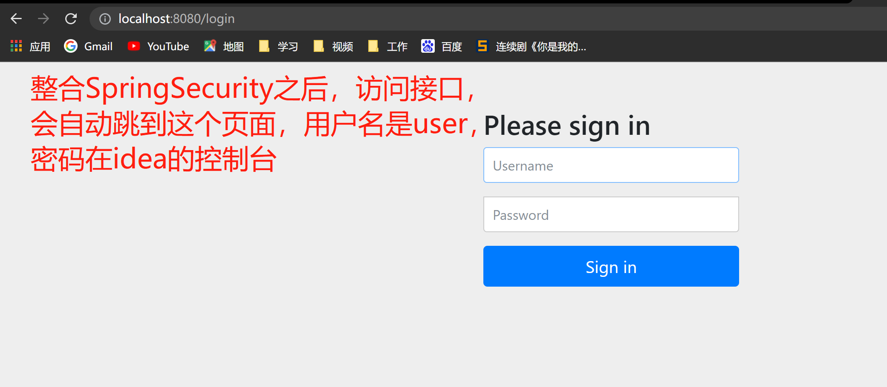
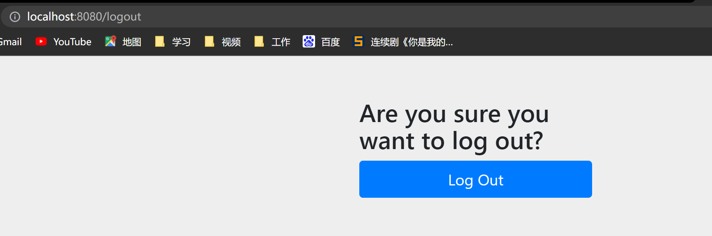
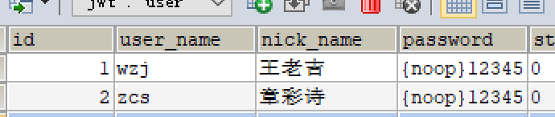
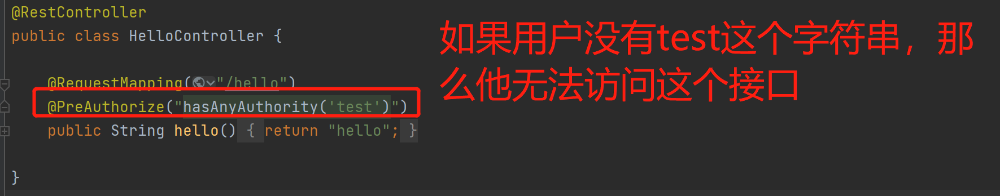

# 1.快速入门

步骤：

1. 创建一个Springboot项目

2. 添加SpringSecurity启动器

   ```xml
   <dependency>
               <groupId>org.springframework.boot</groupId>
               <artifactId>spring-boot-starter-security</artifactId>
   </dependency>
   ```



**在地址栏后面写上logout能退出**，这是SpringSecurity提供的退出接口。SpringSecurity的登录界面是可以换的。



# 2.数据库校验用户核心代码实现

要判断用户是否是合法用户，我们需要去数据库里**检验**。本节是用MyBatis做数据持久化操作的。

## 2.1mybatis准备工作

**Mybatis的配置**

```yaml
mybatis:
  type-aliases-package: com.wzj.domain
  mapper-locations: classpath:mybatis/*.xml
```

**dao接口**

```java
package com.wzj.dao;

import com.wzj.domain.User;
import org.apache.ibatis.annotations.Mapper;

import java.util.List;

/**
 * @Author wzj
 * @Date 2022/2/18 21:44
 */
@Mapper
public interface UserDao {
    //通过用户名查询用户信息
    User selectByUserName(User user);

}
```

**xml文件**

```xml
<?xml version="1.0" encoding="UTF-8"?>
<!DOCTYPE mapper
        PUBLIC "-//mybatis.org//DTD Mapper 3.0//EN"
        "http://mybatis.org/dtd/mybatis-3-mapper.dtd">

<mapper namespace="com.wzj.dao.UserDao">
    <resultMap id="userMap" type="com.wzj.domain.User">
        <!--主键字段的对应-->
        <id property="id" column="id"></id>
        <!--非主键字段的对应-->
        <result property="userName" column="user_name"></result>
        <result property="nickName" column="nick_name"></result>
        <result property="password" column="password"></result>
        <result property="status" column="status"></result>
        <result property="email" column="email"></result>
        <result property="phonenumber" column="phonenumber"></result>
        <result property="sex" column="sex"></result>
        <result property="avatar" column="avatar"></result>
        <result property="userType" column="user_type"></result>
        <result property="createBy" column="create_by"></result>
        <result property="createTime" column="create_time"></result>
        <result property="updateBy" column="update_by"></result>
        <result property="updateTime" column="update_time"></result>
        <result property="delFlag" column="del_flag"></result>
    </resultMap>
    <select id="selectByUserName" resultMap="userMap">
        select * from user where user_name=#{userName}
    </select>


</mapper>
```

## 2.2重写UserDetails接口实现类，到时返回这个玩意

```java
package com.wzj.domain;

import lombok.AllArgsConstructor;
import lombok.Data;
import lombok.NoArgsConstructor;
import org.springframework.security.core.GrantedAuthority;
import org.springframework.security.core.userdetails.UserDetails;

import java.util.Collection;

/**
 * @Author wzj
 * @Date 2022/2/19 13:35
 * 这个类的作用是用来封装用户信息和用户权限信息的，目前这个类只能封装用户信息（private User user）,封装权限信息的方式在标题5
 */
@Data
@NoArgsConstructor
@AllArgsConstructor
public class LoginUser implements UserDetails {
    //数据库查询返回的值是User类型，要求返回UserDetails类型，所以在UserDetails实现类里封装User对象
    private User user;

    @Override
    public Collection<? extends GrantedAuthority> getAuthorities() {
        return null;
    }

    @Override
    public String getPassword() {
        //这里一定要获取密码，不让没法比对密码是否正确
        return user.getPassword();
        //return null;
    }

    @Override
    public String getUsername() {
        return user.getUserName();
    }

    @Override
    public boolean isAccountNonExpired() {
        //return false;
        return true;
    }

    @Override
    public boolean isAccountNonLocked() {
        //return false;
        return true;
    }

    @Override
    public boolean isCredentialsNonExpired() {
        //return false;
        return true;
    }

    @Override
    public boolean isEnabled() {
        //return false;
        return true;
    }
}

```


## 2.3重写UserDetailsService接口

SpringSecurity是通过**UserDetailsService**接口的实现类去查询用户密码的，最后返回一个**UserDetails**对象，所以我们需要重写一个实现UserDetailsService接口的实现类。

```java
package com.wzj.service.impl;

import com.wzj.dao.UserDao;
import com.wzj.domain.LoginUser;
import com.wzj.domain.User;
import lombok.extern.slf4j.Slf4j;
import org.springframework.beans.factory.annotation.Autowired;
import org.springframework.security.core.userdetails.UserDetails;
import org.springframework.security.core.userdetails.UserDetailsService;
import org.springframework.security.core.userdetails.UsernameNotFoundException;
import org.springframework.stereotype.Service;

import java.util.Objects;

/**
 * @Author wzj
 * @Date 2022/2/19 13:20
 */
@Slf4j
@Service
public class UserDetailsServiceImpl implements UserDetailsService {

    @Autowired
    private UserDao userDao;

    @Override
    public UserDetails loadUserByUsername(String s) throws UsernameNotFoundException {
        //这个s参数是我们输入的用户名
        log.info("输出来的s是："+s);

        //查询用户信息
        User user = new User();
        user.setUserName(s);
        //我们只需要通过用户名去查询用户所有信息，密码的比对不用我们写
        User userResult = userDao.selectByUserName(user);
        if (Objects.isNull(userResult)){
            throw new RuntimeException("用户名或密码错误");
        }else {
            log.info(userResult.toString());
        }
        //TODO 查询对应用户权限信息


        //把数据封装成UserDetails
        return new LoginUser(userResult);
    }
}

```

**注意：**如果你的密码是明文存储，那么你需要在密码前面写上{noop}



# 3.用户密码加密

我们存入数据库的密码一般都是**加密**的，SpringSecurity读取密码进行校验的时候，读取的也是加密的密码，为了达到这种效果，我们需要进行配置，为SpringSecurity框架引入**BCryptPasswordEncoder对象**，**PasswordEncoder**是BCryptPasswordEncoder的接口。

```java
//创建配置类，以后可以通过自动注入的方式获取到BCryptPasswordEncoder对象，来对密码进行加密和解密
package com.wzj.config;

import org.springframework.context.annotation.Bean;
import org.springframework.context.annotation.Configuration;
import org.springframework.security.config.annotation.web.configuration.WebSecurityConfigurerAdapter;
import org.springframework.security.crypto.bcrypt.BCryptPasswordEncoder;
import org.springframework.security.crypto.password.PasswordEncoder;

/**
 * @Author wzj
 * @Date 2022/2/19 22:55
 */
@Configuration
public class SecurityConfig extends WebSecurityConfigurerAdapter {


    @Bean
    public PasswordEncoder passwordEncoder(){
        return new BCryptPasswordEncoder();
    }

}
```

当我们用户注册的时候，要用**BCryptPasswordEncoder对象对用户密码进行加密**，这样存入数据库的密码便是加密的密码。SpringSecurity在对密码校验的时候，会调用**BCryptPasswordEncoder对象对用户密码进行解密**，这个解密过程不需要我们自己写，只有加密需要我们自己写。

```java
//这是BCryptPasswordEncoder对象的使用
@SpringBootTest
class SpringsecurityStartApplicationTests {

    @Autowired
    private PasswordEncoder passwordEncoder;

    @Test//下面演示了加密和解密的方法
    void contextLoads() {
        /*String encode = passwordEncoder.encode("123456");
        System.out.println("加密之后的密码："+encode);*/

        //$2a$10$WR/XnpdeNWFtapFbpcyEgup/1LbnZL4.hmktQb4TMblLEPp5lQ1lC
        boolean matches = passwordEncoder.matches("123456", "$2a$10$WR/XnpdeNWFtapFbpcyEgup/1LbnZL4.hmktQb4TMblLEPp5lQ1lC");
        System.out.println("密码校验结果："+matches);
    }

}
```

# 4.SpringSecurity和jwt登录退出总结

1. 用SpringSecurity进行用户登录认证，我们需要自己手动实现**UserDetailsService接口**的类，在这个类里面根据用户名去查询用户信息，查询到的用户信息会和用户传入的密码进行比对。**我们自己实现的这个类，SpringSecurity框架会自动调用它**

2. 正常情况下，我们保存到数据库里的用户密码都是加密的，读取用户密码的时候需要解密，所以我们需要用到SpringSecurity里的**BCryptPasswordEncoder**。它的作用是加密密码，解密密码，所以我们必须为SpringSecurity注入这个对象。在登录的时候，我们应该告诉SpringSecurity**登录接口要放行**。这些内容我们写在配置类里面。

   ```java
   /**
    * @Author wzj
    * @Date 2022/2/19 22:55
    */
   @Configuration
   @EnableGlobalMethodSecurity(prePostEnabled = true)
   public class SecurityConfig extends WebSecurityConfigurerAdapter {
   
       //导入我们自定义的过滤器的bean
       @Autowired
       private JwtAuthenticationTokenFilter jwtAuthenticationTokenFilter;
   
       @Autowired
       private AuthenticationEntryPoint authenticationEntryPoint;
   
       @Autowired
       private AccessDeniedHandler accessDeniedHandler;
   
   
       @Bean
       public PasswordEncoder passwordEncoder(){
           return new BCryptPasswordEncoder();
       }
   
       @Bean
       @Override
       public AuthenticationManager authenticationManagerBean() throws Exception {
           return super.authenticationManagerBean();
       }
   
       @Override
       protected void configure(HttpSecurity http) throws Exception {
           http
                   //关闭csrf
                   .csrf().disable()
                   //不通过Session获取SecurityContext
                   .sessionManagement().sessionCreationPolicy(SessionCreationPolicy.STATELESS)
                   .and()
                   .authorizeRequests()
                   // 对于登录接口 允许匿名访问
                   .antMatchers("/user/login").anonymous()
                   //.antMatchers("/testCors").hasAuthority("system:dept:list")//  /testCors这个路径的接口需要system:dept:list这个权限才能访问 这是标题11的内容
                   // 除上面外的所有请求全部需要鉴权认证
                   .anyRequest().authenticated();
   
           //把token校验过滤器添加到过滤器链中
           http.addFilterBefore(jwtAuthenticationTokenFilter, UsernamePasswordAuthenticationFilter.class);
   
           //配置异常处理器 标题7添加的内容
           http.exceptionHandling()
                   //配置认证失败处理器
                   .authenticationEntryPoint(authenticationEntryPoint)
                   //配置授权失败处理器
                   .accessDeniedHandler(accessDeniedHandler);
           
           //允许跨域
           http.cors();
       }
   }
   ```

3. 到了这一步，我们应该自己来写登录接口，数据库查询操作在步骤一中完成了。所以登录接口的任务是**获取用户登录的用户名和密码**

4. 步骤三写完之后，我们应该写登录接口的业务层。**登录接口的业务层LoginServiceImpl**的任务是，将获取的用户名和密码传递给SpringSecurity的过滤器，进行验证(这个验证过程需要调用我们自己写的UserDetailsService接口的实现类，由这个类去数据库查询用户信息)。如果验证通过，用**JWT生成token**并发送给前端，并**获取用户信息存进Redis**

   ```java
   /**
    * @Author wzj
    * @Date 2022/2/20 15:13
    */
   @Service
   public class LoginServiceImpl implements LoginService {
   
       @Autowired
       private AuthenticationManager authenticationManager;
   
       @Autowired
       private RedisCache redisCache;
   
       @Override
       public ResponseResult login(User user) {
           //AuthenticationManager authenticate对象
           //UsernamePasswordAuthenticationToken的对象是保存前端发来的用户名和密码，作用是和数据库查询到的用户信息作比对
           UsernamePasswordAuthenticationToken authenticationToken = new UsernamePasswordAuthenticationToken(user.getUserName(),user.getPassword());
           //会自动调用我们自定义的UserDetailsServiceImpl，然后比对UserDetailsServiceImpl查询到的用户信息，返回Authentication对象
           Authentication  authenticate = authenticationManager.authenticate(authenticationToken);
   
           //如果认证没通过，给出对应提示
           if (Objects.isNull(authenticate)){
               throw new RuntimeException("登录失败");
           }
   
           //如果认证通过了，用userid生成jwt
           LoginUser loginUser = (LoginUser) authenticate.getPrincipal();
           String userid = loginUser.getUser().getId().toString();
           String jwt = JwtUtil.createJWT(userid);
           Map<String,String> map = new HashMap<>();
           map.put("token",jwt);
   
           //把用户信息存入Redis，userid作为key
           redisCache.setCacheObject("login:"+userid,loginUser);
   
           return new ResponseResult(200,"登录成功",map);
       }
   
       @Override
       public ResponseResult logout() {
           //获取SecurityContextHolder中的用户id 将Authentication强转成UsernamePasswordAuthenticationToken
           UsernamePasswordAuthenticationToken authentication = (UsernamePasswordAuthenticationToken) SecurityContextHolder.getContext().getAuthentication();
           LoginUser loginUser = (LoginUser) authentication.getPrincipal();
           Long userId = loginUser.getUser().getId();
   
           //删除Redis中的值
           redisCache.deleteObject("login:"+userId);
           return new ResponseResult(200,"注销成功");
       }
   }
   ```

5. 我们需要自定义一个过滤器**JwtAuthenticationTokenFilter**。这个过滤器的作用是**拦截请求头的token**。我们通过JWT解析出**token携带的用户id**，然后利用这个id去**Redis里面查询是否有对应的信息**，如果有，证明用户已登录，如果没有，说明用户没有登录。这个过滤器还需要将我们保存到Redis里面的用户信息传递给后面的过滤器，具体就是**存入SecurityContextHolder**。这个过滤器需要配置，在**步骤二中已写明**。

   ```java
   /**
    * @Author wzj
    * @Date 2022/2/23 22:21
    */
   @Component
   public class JwtAuthenticationTokenFilter extends OncePerRequestFilter {
   
       @Autowired
       private RedisCache redisCache;
   
       @Override
       protected void doFilterInternal(HttpServletRequest request, HttpServletResponse response, FilterChain filterChain) throws ServletException, IOException {
           //获取token
           String token = request.getHeader("token");
           if (!StringUtils.hasText(token)){
               //放行
               filterChain.doFilter(request,response);
               //这里写return是为了别的过滤器返回数据后，再这里停止执行，不去执行下面的语句
               return;
           }
   
           //解析token
           String userid;
           try {
               Claims claims = JwtUtil.parseJWT(token);
               userid = claims.getSubject();
           } catch (Exception e) {
               e.printStackTrace();
               throw new RuntimeException("token非法");
           }
   
           //从Redis中获取用户信息
           String redisKey = "login:"+userid;
           //我们存入Redis里面的就是一个LoginUser类型的对象，所以取出来的时候直接写成LoginUser对象即可
           LoginUser loginUser = redisCache.getCacheObject(redisKey);
           if ((Objects.isNull(loginUser))){
               throw new RuntimeException("用户未登录");
           }
   
           //存入SecurityContextHolder
           //TODO 获取权限信息封装到 authenticationToken
           /**
            *在LoginServiceImpl这个类里面我们用过UsernamePasswordAuthenticationToken这个类的构造方法来保存用户从前端发来的用户名和密码，
            * 这里的UsernamePasswordAuthenticationToken使用的是三个参数的构造方法，原因是这个构造方法会将我们查到的用户设置为已认证状态，
            * 后面的过滤器会发现这个标志位是已认证状态。
            * 权限信息还没有，所以是null
            */
           UsernamePasswordAuthenticationToken authenticationToken = new UsernamePasswordAuthenticationToken(loginUser,null,null);
           SecurityContextHolder.getContext().setAuthentication(authenticationToken);
   
           //放行
           filterChain.doFilter(request,response);
       }
   }
   ```

6. 退出接口的表现层主要就是去调用退出接口的**业务层**。退出接口的业务层就是**用SecurityContextHolder取出authenticationToken，利用authenticationToken取出用户信息，Redis根据这用户信息删除掉保存在redis里面的用户信息**。具体代码参考步骤4.

# 5.封装权限

在SpringSecurity里面权限是通过**字符串来标识的。**什么意思呢？比方说，你要访问某个接口，那么SpringSecurity会判断你这个用户有没有标注在接口上的**字符串**，如果这个用户拥有和接口上标注的一模一样的字符串，说明这个用户有访问这个接口的权限。



前面的步骤主要是关于SpringSecurity的整合，SpringSecurity怎么搭配jwt和Redis来做用户的登录认证。从本节开始，主要讲SpringSecurity为不同用户设置不同的权限。

1. **我们需要在SpringSecurity的配置类上添加一个注解@EnableGlobalMethodSecurity(prePostEnabled = true)，开启权限相关的功能**，这个配置类写在了标题4的第2小节内容里面。

2. 我们前面为了让SpringSecurity去我们自己的数据库查询用户信息，我们重写了一个实现了**UserDetailsService接口的类**，这个类不仅可以让SpringSecurity这个框架调用它去实现用户信息查询并返回，其实这个类还可以封装**用户信息并返回**，当然了，这些信息都是封装在**UserDetails对象里面。**

   ```java
   @Slf4j
   @Service
   public class UserDetailsServiceImpl implements UserDetailsService {
   
       @Autowired
       private UserDao userDao;
   
       @Override
       public UserDetails loadUserByUsername(String s) throws UsernameNotFoundException {
   
           log.info("输出来的s是："+s);
   
           //查询用户信息
           User user = new User();
           user.setUserName(s);
           /*user.setPassword("");*/
           User userResult = userDao.selectByUserName(user);
           if (Objects.isNull(userResult)){
               throw new RuntimeException("用户名或密码错误");
           }else {
               log.info(userResult.toString());
           }
           
           //和上面的2.2相比，我们就只是多了下面这行代码，权限test,admin我们先写死，后期再优化
           //TODO 查询对应用户权限信息
           //权限是用字符串记录的，权限有多个，所以这里用List集合
           List<String> list = new ArrayList<>(Arrays.asList("test","admin"));
   
   
           //把数据封装成UserDetails
           return new LoginUser(userResult,list);
       }
   }
   ```

3. **UserDetailsService里的方法的返回类型是UserDetails类型的，**我们前面写了**一个实现了UserDetails接口的LoginUser实体类**，这个实体类封装了我们在UserDetailsServiceImpl里查询到的用户信息，如果你想要封装用户权限信息，那么这个实体我们需要做些简单的改造，方便我们封装用户权限信息。LoginUser这个里面的**getAuthorities方法**也需要我们改造下，让这个方法能够返回用户权限信息。

   ```java
   @Data
   @NoArgsConstructor
   public class LoginUser implements UserDetails {
   
       //存储数据库查到的用户信息
       private User user;
   
       //存储用户的权限信息
       private List<String> perminssions;
   
       public LoginUser(User user, List<String> perminssions){
           this.user = user;
           this.perminssions = perminssions;
       }
   
       //GrantedAuthority是spring里面的类，需要它序列化到Redis里面，不然会报异常
       @JSONField(serialize = false)
       List<GrantedAuthority> authorities;
       @Override
       public Collection<? extends GrantedAuthority> getAuthorities() {
           if (authorities != null){
               return authorities;
           }
           //获取权限信息
           //把perminssions中String类型的权限信息封装成SimpleGrantedAuthority对象
           authorities = new ArrayList<>();
           for (String perminssion : perminssions) {
               SimpleGrantedAuthority authority = new SimpleGrantedAuthority(perminssion);
               authorities.add(authority);
           }
           return authorities;
       }
   
       @Override
       public String getPassword() {
           return user.getPassword();
           //return null;
       }
   
       @Override
       public String getUsername() {
           return user.getUserName();
       }
   
       @Override
       public boolean isAccountNonExpired() {
           //return false;
           return true;
       }
   
       @Override
       public boolean isAccountNonLocked() {
           //return false;
           return true;
       }
   
       @Override
       public boolean isCredentialsNonExpired() {
           //return false;
           return true;
       }
   
       @Override
       public boolean isEnabled() {
           //return false;
           return true;
       }
   }
   ```

4. 我们现在需要改造下我们自己定义的过滤器，标题4的第5部分的内容我们改一下

   ```java
   @Component
   public class JwtAuthenticationTokenFilter extends OncePerRequestFilter {
   
       @Autowired
       private RedisCache redisCache;
   
       @Override
       protected void doFilterInternal(HttpServletRequest request, HttpServletResponse response, FilterChain filterChain) throws ServletException, IOException {
           //获取token
           String token = request.getHeader("token");
           if (!StringUtils.hasText(token)){
               //放行
               filterChain.doFilter(request,response);
               //这里写return是为了别的过滤器返回数据后，再这里停止执行，不去执行下面的语句
               return;
           }
   
           //解析token
           String userid;
           try {
               Claims claims = JwtUtil.parseJWT(token);
               userid = claims.getSubject();
           } catch (Exception e) {
               e.printStackTrace();
               throw new RuntimeException("token非法");
           }
   
           //从Redis中获取用户信息
           String redisKey = "login:"+userid;
           //我们存入Redis里面的就是一个LoginUser类型的对象，所以取出来的时候直接写成LoginUser对象即可
           LoginUser loginUser = redisCache.getCacheObject(redisKey);
           if ((Objects.isNull(loginUser))){
               throw new RuntimeException("用户未登录");
           }
   
           //存入SecurityContextHolder
           //TODO 获取权限信息封装到 authenticationToken
           //这部分就是我们改造代码的地方，上面第3部分改造的内容在这里用上了，我们可以通过他获取权限信息
           UsernamePasswordAuthenticationToken authenticationToken = new UsernamePasswordAuthenticationToken(loginUser,null,loginUser.getAuthorities());
           SecurityContextHolder.getContext().setAuthentication(authenticationToken);
   
           //放行
           filterChain.doFilter(request,response);
       }
   }
   ```

5. 我们怎么规定哪些权限可以访问接口呢？答案是在接口上面添加一个注解**@PreAuthorize("hasAnyAuthority('xxx')")**，xxx代表的就是你设置的权限

   ```java
   @RestController
   public class HelloController {
   
       @RequestMapping("/hello")
       @PreAuthorize("hasAnyAuthority('test')")
       public String hello(){
           return "hello";
       }
   
   }
   ```


# 6.从数据库查询用户的权限

在步骤5中，我们在**UserDetailsService**的实现类里面将权限写死，封装到了**UserDetails**的实现类LonginUser里面，最后将LoginUser的对象返回。本节的内容主要是如何从数据库获取用户的权限信息，最后将用户信息和权限信息一起封装到UserDetails的实现类里面。

关于权限，目前最常见的是RBAC权限模型。为此，我们需要在数据库建表：**用户表、角色表、用户角色表、权限表和角色权限表**。用户和角色关联，角色和权限关联。一个用户可以有多个角色，一个角色可以有多个权限。

```sql
CREATE DATABASE /*!32312 IF NOT EXISTS*/`sg_security` /*!40100 DEFAULT CHARACTER SET utf8mb4 */;

USE `sg_security`;

/*Table structure for table `sys_menu` */

DROP TABLE IF EXISTS `sys_menu`;

CREATE TABLE `sys_menu` (
  `id` bigint(20) NOT NULL AUTO_INCREMENT,
  `menu_name` varchar(64) NOT NULL DEFAULT 'NULL' COMMENT '菜单名',
  `path` varchar(200) DEFAULT NULL COMMENT '路由地址',
  `component` varchar(255) DEFAULT NULL COMMENT '组件路径',
  `visible` char(1) DEFAULT '0' COMMENT '菜单状态（0显示 1隐藏）',
  `status` char(1) DEFAULT '0' COMMENT '菜单状态（0正常 1停用）',
  `perms` varchar(100) DEFAULT NULL COMMENT '权限标识',
  `icon` varchar(100) DEFAULT '#' COMMENT '菜单图标',
  `create_by` bigint(20) DEFAULT NULL,
  `create_time` datetime DEFAULT NULL,
  `update_by` bigint(20) DEFAULT NULL,
  `update_time` datetime DEFAULT NULL,
  `del_flag` int(11) DEFAULT '0' COMMENT '是否删除（0未删除 1已删除）',
  `remark` varchar(500) DEFAULT NULL COMMENT '备注',
  PRIMARY KEY (`id`)
) ENGINE=InnoDB AUTO_INCREMENT=2 DEFAULT CHARSET=utf8mb4 COMMENT='菜单表';

/*Table structure for table `sys_role` */

DROP TABLE IF EXISTS `sys_role`;

CREATE TABLE `sys_role` (
  `id` bigint(20) NOT NULL AUTO_INCREMENT,
  `name` varchar(128) DEFAULT NULL,
  `role_key` varchar(100) DEFAULT NULL COMMENT '角色权限字符串',
  `status` char(1) DEFAULT '0' COMMENT '角色状态（0正常 1停用）',
  `del_flag` int(1) DEFAULT '0' COMMENT 'del_flag',
  `create_by` bigint(200) DEFAULT NULL,
  `create_time` datetime DEFAULT NULL,
  `update_by` bigint(200) DEFAULT NULL,
  `update_time` datetime DEFAULT NULL,
  `remark` varchar(500) DEFAULT NULL COMMENT '备注',
  PRIMARY KEY (`id`)
) ENGINE=InnoDB AUTO_INCREMENT=3 DEFAULT CHARSET=utf8mb4 COMMENT='角色表';

/*Table structure for table `sys_role_menu` */

DROP TABLE IF EXISTS `sys_role_menu`;

CREATE TABLE `sys_role_menu` (
  `role_id` bigint(200) NOT NULL AUTO_INCREMENT COMMENT '角色ID',
  `menu_id` bigint(200) NOT NULL DEFAULT '0' COMMENT '菜单id',
  PRIMARY KEY (`role_id`,`menu_id`)
) ENGINE=InnoDB AUTO_INCREMENT=2 DEFAULT CHARSET=utf8mb4;

/*Table structure for table `sys_user` */

DROP TABLE IF EXISTS `sys_user`;

CREATE TABLE `sys_user` (
  `id` bigint(20) NOT NULL AUTO_INCREMENT COMMENT '主键',
  `user_name` varchar(64) NOT NULL DEFAULT 'NULL' COMMENT '用户名',
  `nick_name` varchar(64) NOT NULL DEFAULT 'NULL' COMMENT '昵称',
  `password` varchar(64) NOT NULL DEFAULT 'NULL' COMMENT '密码',
  `status` char(1) DEFAULT '0' COMMENT '账号状态（0正常 1停用）',
  `email` varchar(64) DEFAULT NULL COMMENT '邮箱',
  `phonenumber` varchar(32) DEFAULT NULL COMMENT '手机号',
  `sex` char(1) DEFAULT NULL COMMENT '用户性别（0男，1女，2未知）',
  `avatar` varchar(128) DEFAULT NULL COMMENT '头像',
  `user_type` char(1) NOT NULL DEFAULT '1' COMMENT '用户类型（0管理员，1普通用户）',
  `create_by` bigint(20) DEFAULT NULL COMMENT '创建人的用户id',
  `create_time` datetime DEFAULT NULL COMMENT '创建时间',
  `update_by` bigint(20) DEFAULT NULL COMMENT '更新人',
  `update_time` datetime DEFAULT NULL COMMENT '更新时间',
  `del_flag` int(11) DEFAULT '0' COMMENT '删除标志（0代表未删除，1代表已删除）',
  PRIMARY KEY (`id`)
) ENGINE=InnoDB AUTO_INCREMENT=3 DEFAULT CHARSET=utf8mb4 COMMENT='用户表';

/*Table structure for table `sys_user_role` */

DROP TABLE IF EXISTS `sys_user_role`;

CREATE TABLE `sys_user_role` (
  `user_id` bigint(200) NOT NULL AUTO_INCREMENT COMMENT '用户id',
  `role_id` bigint(200) NOT NULL DEFAULT '0' COMMENT '角色id',
  PRIMARY KEY (`user_id`,`role_id`)
) ENGINE=InnoDB DEFAULT CHARSET=utf8mb4;

```

当建表成功后，我们应该在**UserDetailsService**的实现类里面写上如下功能的代码：

1. 根据用户id在**用户角色表**查询用户所对应的角色（一个用户可能有多个角色）
2. 根据步骤1查询到的角色id去**角色表**查询状态为可用的角色
3. 根据步骤2查询到的**可用**的角色去**角色权限表**查询角色对应的权限信息
4. 根据步骤3查询到的权限id去**权限表**查询状态为可用的权限有哪些
5. 将步骤4查询到的状态为可用的权限**添加到一个List<String>里面，然后将这个集合封装到UserDetails实现类的对象里面**。

```java
//本节内容需要的实体类
//User类
package com.wzj.domain;

import lombok.AllArgsConstructor;
import lombok.Data;
import lombok.NoArgsConstructor;

import java.io.Serializable;
import java.util.Date;


/**
 * 用户表(User)实体类
 *
 * @author 三更
 */
@Data
@AllArgsConstructor
@NoArgsConstructor
public class User implements Serializable {
    private static final long serialVersionUID = -40356785423868312L;
    
    /**
    * 主键
    */
    private Long id;
    /**
    * 用户名
    */
    private String userName;
    /**
    * 昵称
    */
    private String nickName;
    /**
    * 密码
    */
    private String password;
    /**
    * 账号状态（0正常 1停用）
    */
    private String status;
    /**
    * 邮箱
    */
    private String email;
    /**
    * 手机号
    */
    private String phonenumber;
    /**
    * 用户性别（0男，1女，2未知）
    */
    private String sex;
    /**
    * 头像
    */
    private String avatar;
    /**
    * 用户类型（0管理员，1普通用户）
    */
    private String userType;
    /**
    * 创建人的用户id
    */
    private Long createBy;
    /**
    * 创建时间
    */
    private Date createTime;
    /**
    * 更新人
    */
    private Long updateBy;
    /**
    * 更新时间
    */
    private Date updateTime;
    /**
    * 删除标志（0代表未删除，1代表已删除）
    */
    private Integer delFlag;
}

//角色类
import lombok.Data;

import java.util.Date;

/**
 * @Author wzj
 * @Date 2022/3/26 17:15
 */
@Data
public class Role {

    Long id;//角色id
    String name;//角色名
    String role_key;//角色权限字符串
    Character status;//角色状态（0正常 1停用）
    Integer del_flag;
    Integer create_by;
    Date create_time;
    Integer update_by;
    Date update_time;
    String remark;

}

//用户角色类
import lombok.Data;

/**
 * @Author wzj
 * @Date 2022/3/26 16:04
 */
@Data
public class User_Role {

    Long user_id;
    Long role_id;

}

//权限表
import com.fasterxml.jackson.annotation.JsonInclude;
import lombok.AllArgsConstructor;
import lombok.Data;
import lombok.NoArgsConstructor;

import java.io.Serializable;
import java.util.Date;

/**
 * 菜单表(Menu)实体类
 *
 * @author makejava
 * @since 2021-11-24 15:30:08
 */
@Data
@AllArgsConstructor
@NoArgsConstructor
@JsonInclude(JsonInclude.Include.NON_NULL)
public class Menu implements Serializable {
    private static final long serialVersionUID = -54979041104113736L;
    
    private Long id;
    /**
    * 菜单名
    */
    private String menuName;
    /**
    * 路由地址
    */
    private String path;
    /**
    * 组件路径
    */
    private String component;
    /**
    * 菜单状态（0显示 1隐藏）
    */
    private String visible;
    /**
    * 菜单状态（0正常 1停用）
    */
    private String status;
    /**
    * 权限标识
    */
    private String perms;
    /**
    * 菜单图标
    */
    private String icon;
    
    private Long createBy;
    
    private Date createTime;
    
    private Long updateBy;
    
    private Date updateTime;
    /**
    * 是否删除（0未删除 1已删除）
    */
    private Integer delFlag;
    /**
    * 备注
    */
    private String remark;
}

//角色权限
import lombok.Data;

/**
 * @Author wzj
 * @Date 2022/3/26 18:54
 */
@Data
public class Role_Menu {

    Long role_id;
    Long menu_id;

}
```

**Dao类**

```java
/**
 * @Author wzj
 * @Date 2022/3/26 16:06
 */
@Mapper
public interface User_RoleDao {

    //根据用户id查询sys_user_role表的角色id
    List<User_Role> selectRoleIdByUid(Long id);

}

/**
 * @Author wzj
 * @Date 2022/3/26 17:30
 */
@Mapper
public interface RoleDao {

    //根据角色id和角色状态查询角色信息
    Role selectByRoleId(Long id);

}

@Mapper
public interface Role_MenuDao {

    //根据角色id查询权限id
    List<Role_Menu> selectMenuIdByRoleId(Long id);

}

/**
 * @Author wzj
 * @Date 2022/3/23 21:17
 */
@Mapper
public interface MenuDao {

    //根据UserId来查询权限的，所以传入的值是User类型的
    List<Menu> selectPermsByRoleId(Long id);

}
```

**Service**

```java
/**
 * @Author wzj
 * @Date 2022/3/26 16:50
 */
@Service
public class UserRoleServiceImpl implements UserRoleService {

    @Autowired
    User_RoleDao user_roleDao;

    //获取查询到的角色id
    @Override
    public List<Long> getRoleId(Long id) {
        List<User_Role> user_roles = user_roleDao.selectRoleIdByUid(id);

        //查询到的角色可能有多个，所以用List数组
        List<Long> list = new ArrayList<>();
        //遍历集合，取出查询到的角色id
        for (User_Role user_role:
             user_roles) {
            Long role_id = user_role.getRole_id();
            list.add(role_id);
        }
        return list;
    }
}


/**
 * @Author wzj
 * @Date 2022/3/26 17:52
 */
@Service
public class RoleServiceImpl implements RoleService {

    @Autowired
    RoleDao roleDao;

    @Override
    public List<Long> getRoleId(List<Long> ids) {

        List<Long> lists = new ArrayList<>();
        //变量传进来的角色id,查询状态是可用的角色，并获取这些角色的id
        for (Long id:ids
             ) {
            Role role = roleDao.selectByRoleId(id);
            lists.add(role.getId());
        }
        //获取角色id并返回
        return lists;
    }
}

/**
 * @Author wzj
 * @Date 2022/3/26 19:48
 */
@Service
public class RoleMenuServiceImpl implements RoleMenuService {

    @Autowired
    private Role_MenuDao role_menuDao;

    @Override
    public List<Long> getMenuIds(List<Long> ids) {

        List<Long> list = new ArrayList<>();

        //根据角色id查询sys_role_menu里的权限id
        for (Long id:ids
             ) {
            List<Role_Menu> role_menus = role_menuDao.selectMenuIdByRoleId(id);
            //遍历获取到的权限id
            for (Role_Menu role_menu:role_menus
                 ) {
                Long menu_id = role_menu.getMenu_id();
                list.add(menu_id);
            }
        }
        return list;
    }


}

/**
 * @Author wzj
 * @Date 2022/3/26 20:36
 */
@Service
public class MenuServiceImple implements MenuService {

    @Autowired
    private MenuDao menuDao;
    @Override
    public List<String> getPermissionKeys(List<Long> menuIds) {
        List<String> lists = new ArrayList<>();
        //遍历传进来的权限id集合，获取状态为可用的权限
        for (Long menuid:menuIds
             ) {
            //查询状态为可用的权限对象
            List<Menu> menus = menuDao.selectPermsByRoleId(menuid);
            //获取具体的权限信息
            for (Menu menu:menus
                 ) {
                //获取权限信息并添加到List集合里面
                lists.add(menu.getPerms());
            }
        }
        return lists;
    }
}
```


```java
//再次更新的UserDetailService接口的实现类
import com.wzj.dao.UserDao;
import com.wzj.domain.LoginUser;
import com.wzj.domain.User;
import com.wzj.service.MenuService;
import com.wzj.service.RoleMenuService;
import com.wzj.service.RoleService;
import com.wzj.service.UserRoleService;
import lombok.extern.slf4j.Slf4j;
import org.springframework.beans.factory.annotation.Autowired;
import org.springframework.security.core.userdetails.UserDetails;
import org.springframework.security.core.userdetails.UserDetailsService;
import org.springframework.security.core.userdetails.UsernameNotFoundException;
import org.springframework.stereotype.Service;

import java.util.ArrayList;
import java.util.Arrays;
import java.util.List;
import java.util.Objects;

/**
 * @Author wzj
 * @Date 2022/2/19 13:20
 */
@Slf4j
@Service
public class UserDetailsServiceImpl implements UserDetailsService {

    @Autowired
    private UserDao userDao;

    @Autowired
    private UserRoleService userRoleService;

    @Autowired
    private RoleService roleService;

    @Autowired
    private RoleMenuService roleMenuService;

    @Autowired
    private MenuService menuService;

    @Override
    public UserDetails loadUserByUsername(String s) throws UsernameNotFoundException {

        log.info("输出来的s是："+s);

        //查询用户信息
        User user = new User();
        user.setUserName(s);
        /*user.setPassword("");*/
        User userResult = userDao.selectByUserName(user);
        if (Objects.isNull(userResult)){
            throw new RuntimeException("用户名或密码错误");
        }else {
            log.info(userResult.toString());
        }
        //TODO 查询对应用户权限信息
        //权限是用字符串记录的，权限有多个，所以这里用List集合
        //List<String> list = new ArrayList<>(Arrays.asList("test","admin"));

        //根据用户id去sys_user_role表查询角色id
        List<Long> roleIds = userRoleService.getRoleId(userResult.getId());

        //根据查询到的角色id去查询角色表，原因是我们要通过这个步骤查询用户id所对应的未停用的角色id
        List<Long> roleStatusId = roleService.getRoleId(roleIds);

        //根据查询到的status=0的角色的id去查询sys_role_menu表，获取权限id
        List<Long> menuIds = roleMenuService.getMenuIds(roleStatusId);

        //根据查询到的权限id，去sys_menu查询权限状态为0（可用）的角色的具体权限
        List<String> permissionKeys = menuService.getPermissionKeys(menuIds);

        //把数据封装成UserDetails,UserDetails封装了用户信息和用户权限信息
        return new LoginUser(userResult,permissionKeys);
    }
}
```

# 7.自定义失败处理

我们**认证用户和认证用户权限**是有可能出现异常的，那么本节内容手是关于这两个异常的解决办法。

在SpringSecurity中，如果我们在认证或者授权的过程中出现了异常会被**ExceptionTranslationFilter**捕获到。在ExceptionTranslationFilter中会去判断是认证失败还是授权失败出现的异常。

如果是**认证过程中**出现的异常会被封装成**AuthenticationException**然后调用**AuthenticationEntryPoint**对象的方法去进行异常处理。

如果是**授权过程中**出现的异常会被封装成**AccessDeniedException**然后调用**AccessDeniedHandler**对象的方法去进行异常处理。

所以如果我们需要自定义异常处理，我们只需要**自定义AuthenticationEntryPoint和AccessDeniedHandler这连个接口的实现类**，然后配置给SpringSecurity即可。

**自定义实现类**

```java
/**
 * @Author wzj
 * @Date 2022/4/3 14:21
 */
@Component
public class AuthenticationEntryPointImpl implements AuthenticationEntryPoint {
    @Override
    public void commence(HttpServletRequest request, HttpServletResponse response, AuthenticationException e) throws IOException, ServletException {
        //生成返回给前端的json字符串。Spring提供的枚举类HttpStatus.UNAUTHORIZED，401
        ResponseResult result = new ResponseResult(HttpStatus.UNAUTHORIZED.value(),"用户认证失败，请重新登录");
        String json = JSON.toJSONString(result);
        //处理认证异常 WebUtils这个工具类提供了一个设置返回状态码等功能的方法
        WebUtils.renderString(response,json);
    }
}

/**
 * @Author wzj
 * @Date 2022/4/3 14:38
 */
@Component
public class AccessDeniedHandlerImpl implements AccessDeniedHandler {
    @Override
    public void handle(HttpServletRequest request, HttpServletResponse response, AccessDeniedException e) throws IOException, ServletException {
        //生成返回给前端的json字符串。Spring提供的枚举类HttpStatus.UNAUTHORIZED，403
        ResponseResult result = new ResponseResult(HttpStatus.FORBIDDEN.value(),"您的权限不足");
        String json = JSON.toJSONString(result);
        //处理授权异常 WebUtils这个工具类提供了一个设置返回状态码等功能的方法
        WebUtils.renderString(response,json);
    }
}

```

**将上面的两个异常实现类添加到配置类里面**，详见标题4

# 8.跨域问题

微服务项目下，一般用网关来做跨域，这个可以了解一下

为了实现跨域，我们首先需要**配置SpringBoot**，我们写一个配置类

```java
@Configuration
public class CorsConfig implements WebMvcConfigurer {

    @Override
    public void addCorsMappings(CorsRegistry registry) {
      // 设置允许跨域的路径
        registry.addMapping("/**")
                // 设置允许跨域请求的域名
                //.allowedOriginPatterns("*")
                .allowedOrigins("*") //上面那个不行，原因暂时不明，改用这个方法
                // 是否允许cookie
                .allowCredentials(true)
                // 设置允许的请求方式
                .allowedMethods("GET", "POST", "DELETE", "PUT")
                // 设置允许的header属性
                .allowedHeaders("*")
                // 跨域允许时间
                .maxAge(3600);
    }
}
```

然后在SpringSecurity的配置类设置允许跨域，就一行代码，详见标题4

# 9.其他权限校验方法

我们前面都是使用@PreAuthorize注解，然后在在其中使用的是hasAuthority方法进行校验。SpringSecurity还为我们提供了其它方法例如：hasAnyAuthority，hasRole，hasAnyRole等。

​    

​	这里我们先不急着去介绍这些方法，我们先去理解hasAuthority的原理，然后再去学习其他方法你就更容易理解，而不是死记硬背区别。并且我们也可以选择定义校验方法，实现我们自己的校验逻辑。

​	hasAuthority方法实际是执行到了SecurityExpressionRoot的hasAuthority，大家只要断点调试既可知道它内部的校验原理。

​	它内部其实是调用authentication的getAuthorities方法获取用户的权限列表。然后判断我们存入的方法参数数据在权限列表中。


​	hasAnyAuthority方法可以传入多个权限，只有用户有其中任意一个权限都可以访问对应资源。

~~~~java
    @PreAuthorize("hasAnyAuthority('admin','test','system:dept:list')")
    public String hello(){
        return "hello";
    }
~~~~


​	hasRole要求有对应的角色才可以访问，但是它内部会把我们传入的参数拼接上 **ROLE_** 后再去比较。所以这种情况下要用用户对应的权限也要有 **ROLE_** 这个前缀才可以。

~~~~java
    @PreAuthorize("hasRole('system:dept:list')")
    public String hello(){
        return "hello";
    }
~~~~


​	hasAnyRole 有任意的角色就可以访问。它内部也会把我们传入的参数拼接上 **ROLE_** 后再去比较。所以这种情况下要用用户对应的权限也要有 **ROLE_** 这个前缀才可以。

~~~~java
    @PreAuthorize("hasAnyRole('admin','system:dept:list')")
    public String hello(){
        return "hello";
    }
~~~~

# 10.自定义权限校验方法

在一些大型项目中，我们可能有些特殊需求，那么我们可以自己来自定义权限校验方法。

我们在SpringSecurity中是使用注解**@PreAuthorize**来进行权限的配置的，调用我们自定的权限校验方法同样是需要使用这个注解。**那么让SpringSecurity去调用我们自定义的权限校验方法呢？**答案是将自定权限校验方法所在的类生成bean并给它起个名字，然后在@PreAuthorize注解里就可以通过这个bean去调用到我们自定义的校验方法。

**自定义权限校验方法**

```java
/**
 * @Author wzj
 * @Date 2022/4/4 15:21
 */

@Component("ex")//给这个bean起名叫ex
public class WZJExpressionRoot {

    //自定义权限校验方法
    public boolean hasAuthority(String authority){
        //获取当前用户权限
        Authentication authentication = SecurityContextHolder.getContext().getAuthentication();
        //在过滤器JwtAuthenticationTokenFilter中，我们添加的就是Loginuser对象，所以这里可以强转成这个类型
        LoginUser loginUser = (LoginUser)authentication.getPrincipal();
        List<String> perminssions = loginUser.getPerminssions();
        //判断用户权限集合中是否存在authority
        return perminssions.contains(authority);
    }

}
```

在SPEL表达式中使用 @ex相当于获取容器中bean的名字未ex的对象。然后再调用这个对象的hasAuthority方法

```java
@RestController
public class HelloController {

    @RequestMapping("/hello")
    @PreAuthorize("@ex.hasAuthority('system:dept:list')")
    public String hello(){
        return "hello";
    }

}
```

# 11.基于配置的权限控制

我们可以在**SpringSecurity的配置类**里面为借口配置权限，我个人觉得这种方式不是很方便，详见标题4

```java
//这是本次实验的接口
@RequestMapping("/testCors")
    public ResponseResult testCors(){
        return new ResponseResult(200,"testCors");
    }
```


